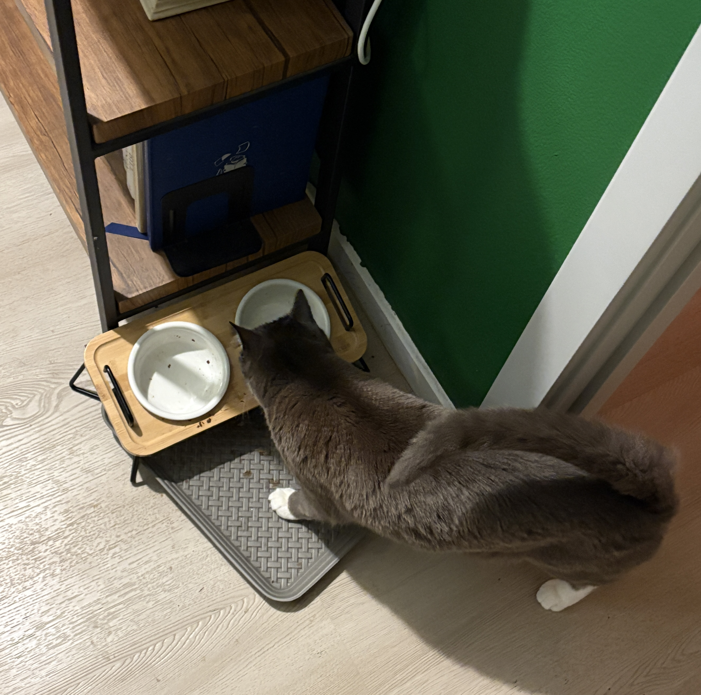
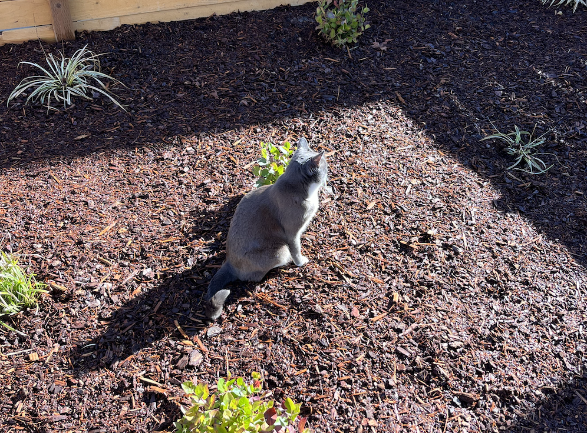
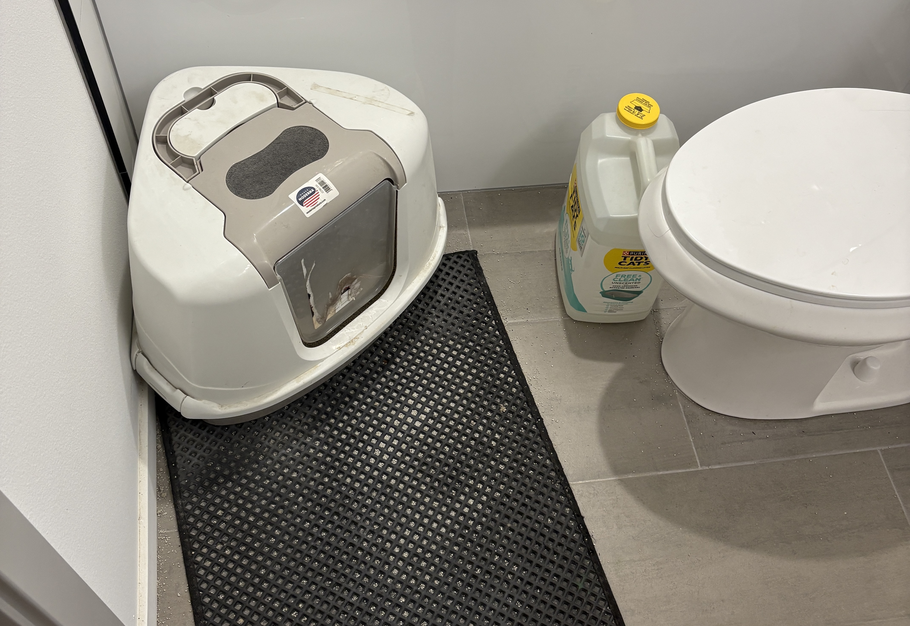

# Food

I feed him by hand for all meals, and occasionally give him treats whenever I (attempt to) teach him tricks. If you're hanging out with him in the hour or two before he gets fed, he WILL start meowing at you to feed him. If you can, feed him on time, but it's ok to cave (or your heart) if your schedule conflicts.

- Breakfast: A single 1/2 cup scoop of dry food.
- Dinner: An entire can of fancy feast @ ~6:30pm
  - *Both of these times can be + or - a few hours to better fit your schedule*

When they're getting dirty, I will just run the bowls through the dishwasher. 

The food that that he eats is readily available at most grocery stores in the pet section. The closest place to get it is at the [Saar's on Aurora](https://www.saarssupersaverfoods.com/StoreLocator/Store/?L=750634&S=). His food should already be plentifully stocked on the bottom right are of the office closet. If I miscalculated and didn't leave enough, please get more and Venmo me in the cost (@Sivan-Mehta).

His water fountain will be topped off, you don't need to refill it, but you should check it every day to make sure it's still working. If it stops working, please let me know ASAP. He will drink from a bowl if the fountain is broken, but he prefers the fountain.

## Stimulation

Cats are very good at occupying themselves, but they are still social. You don't need to do a whole lot except spend time with him. If you want to play with him, his favorite toys are the laser pointer and the lure. A good rule of thumb is that he _loves_ chasing things that hide. For example: the lure isn't interesting if it's dangling in front of face. The lure _is_ interesting if it flits back and forth around corners. There are also approximately 85 million videos online on "how to play with a cat" if you're in need of inspiration. A great rule of thumb is to match his energy. So if you notice he's got the _zoomies_, that's a great time to let him express his inner apex predator. If you want to play with him, his favorite toys are a shoelace and the lure. We will leave them out in an obvious place.

A good rule of thumb is that he _loves_ chasing things that hide. For example: the lure isn't interesting if it's dangling in front of face. The lure _is_ interesting if it flits back and forth around corners.

### Boundaries

Taco is an indoor cat, so as much as he may try, don't let him escape out the front door. He will often greet me at the door and immediately try to go out the door so just be wary whenever you're coming in.

He is allowed outside, but ***ONLY*** under supervision. He has not learned any skills that would keep him safe in a life outside. If you're hanging out in the yard with him, be aware when he gets close to the front door, as he can easily hop up and over it.

I'm not going to be gone long enough for the plants themselves to need care, the only thing I need from you is not let Taco chew on them. He doesn't have a history of doing so, only ever occasionally rubbing up against them. Should that change, please let me know.

Scratching is an innate behavior to cats and is a way for them to mark their territory. All of my furniture was bought with the intent of tolerating him scratching it, so don't worry about him going to town on a chair or couch.

## Cleaning

His litterbox is located in the office bathroom, the scooper is under the sink. There will be more than enough litter in the box that you do not need to refill it while I'm gone, all you need to do is scoop it. There is a bin next to the litterbox where I dump his use litter. I scoop once a day. Scooping also provides you with a good opportunity to check on his health. If you notice that he's not using the litter box, or that he's using anything else as a bathroom, please let me know ASAP.

You don't need to brush him, as all cats meticulously groom themselves. I already brush him 2-3 times a week, so he should be fine without it until I get back. However he does really like getting brushed so if you want to, go for it.
