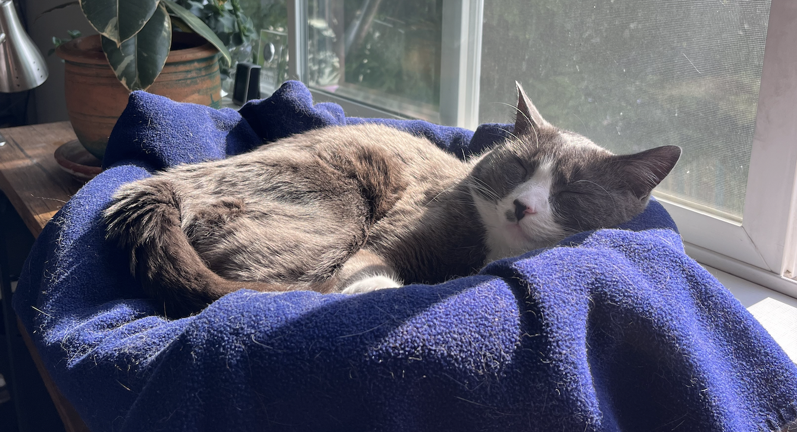
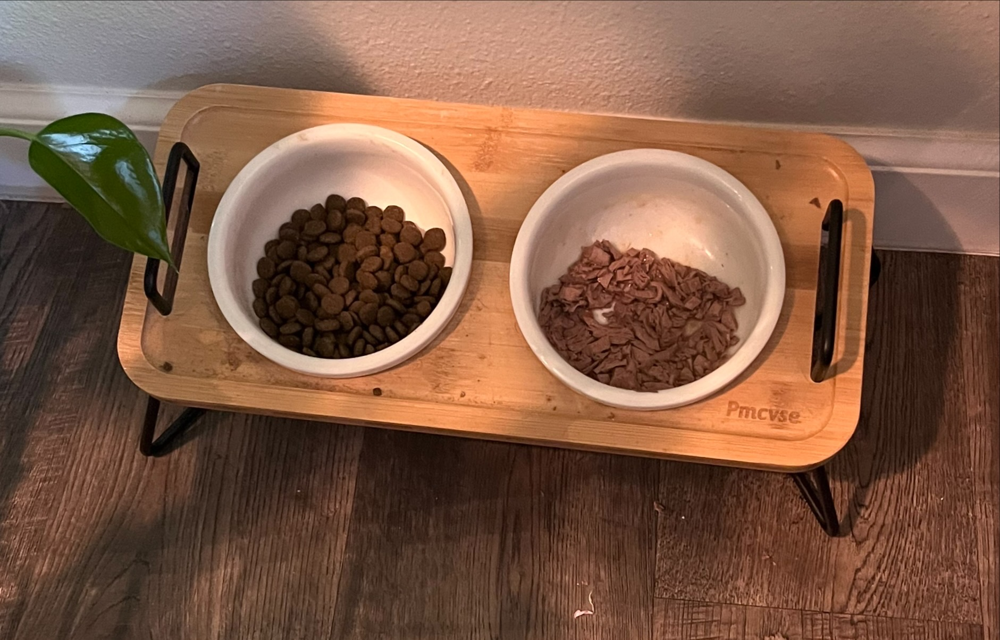
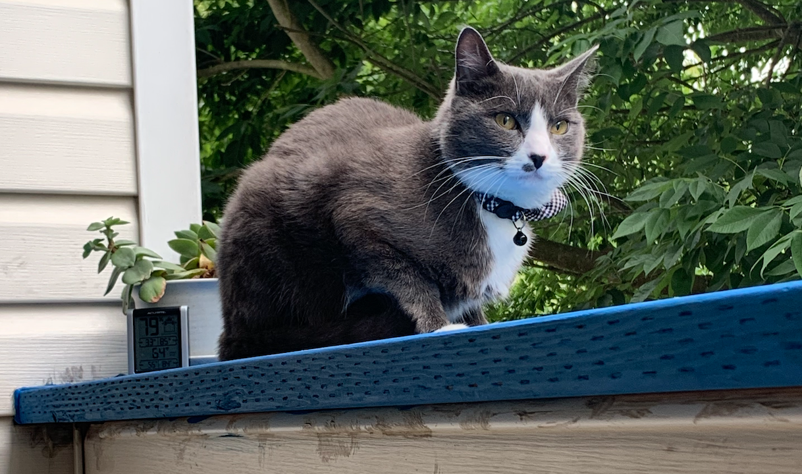

# Taking care of Taco

## Important tidbits

- Sivan: 914-584-5975
- Arunima: 425-269-2336
- Greenwood Animal Hospital:
  - 206-528-3838
  - 10000 Aurora Ave. N, Unit # 8, Seattle, WA 98133
  - it's across the street

This guide is a lot longer than it probably needs to be. But I like to ramble, so please humor me.

## Feeding

We feed him Fancy Feast cans for all meals, and give him treats whenever we (attempt to) teach him tricks. We also keep dry food in the right bowl mostly topped off so he can graze whenever he is feeling peckish. If you're hanging out with him in the hour or two before he gets fed, he WILL start meowing at you to feed him. If you can, feed him on time, but it's ok to cave if your schedule conflicts.

- Breakfast: 1 can of Fancy Feast @ ~8:30am
- Lunch: 1/2 can @ ~12:30
- Dinner: 1 can @ ~6:30
  - *All of these times can be + or - an hour to better fit your schedule*
  - *Lunch is also a nice-to-have, he'll be fine without it if you can't make it*

The Fancy Feast that he eats is readily available at most grocery stores in the pet section. The closest place to get it is at  the Fred Meyer on 85th and 1st. His food should already be plentifully stocked on the bottom left pantry shelf in boxes. If we miscalculated and didn't leave enough, please get more and Venmo us in the cost (@Sivan-Mehta).

## Stimulation

Cats are very good at occupying themselves, but they are still social. You don't need to do a whole lot except spend time with him. Try to spend at least an hour total with him. This can accompany meal times, or whenever you're in the neighborhood. If you want to play with him, his favorite toys are the laser pointer and the lure.

A good rule of thumb is that he _loves_ chasing things that hide. For example: the lure isn't interesting if it's dangling in front of face. The lure _is_ interesting if it flits back and forth around corners.

### Boundaries

Taco is an indoor cat, so as much as he may try, don't let him escape out the front door. He will often greet us at the door and immediately try to go out the door so just be wary whenever you're coming in. He is allowed on the porch and the ledge there.

We usually leave the porch door open whenever we're here. Since we're not going to be here, please have the porch door closed. Feel free to let him out whenever you are here. He doesn't need to be monitored out there since the porch is too high for him to jump from. 

We also do not let Taco on the counters. Our rule of thumb is that wherever food is prepared or ate, he should not go. This includes kitchen counters, fridge, and the metal rack / pantry. If we makes his way up there, give him a spritz with a spray bottle. If a spray bottle isn't handy, you can also just push him off the table.

The fish tank is also obviously off limits. Fish are friends, not food.

### Plants

We're not going to be gone long enough for the plants themselves to need care, the only thing we need from you is not let Taco chew on them. He doesn't have a history of doing so, but discouraging him with a spray bottle has worked.

### Fish Tank

The fish should be relatively easy to take care of. The water level should be fine for the entirety of the time that we are gone, so no need to worry about that. Once a day, whether that is during Taco’s breakfast or dinner, just take a pinch of the “Micro Pellets” fish food and put it in the tank. You’ll be able to find the fish food on the top metal bin on the side of the left shelf (you’ll notice that there are some teeth marks that good ole Taco got into). The metal mesh on top of the tank is purely there as an anti-Taco deterrent. You can remove it while you're feeding the fish.

The fishes' names are Shareef, Sinogue, Samantha, and Sally. Snaily also lives in the tank, he does not any care because he literally lives off the grime.

## Cleaning

His litterbox is located in the guest bathroom, the scooper is under the sink. There will be more than enough litter in the box that you do not need to refill it while we're gone, all you need to do is scoop it. There is a bin next to the litterbox where we dump his use litter. The typical routine that we use is scoop --> vacuum any bits that have fallen --> febreze. We scoop once a day. 

You don't need to brush him, as all cats meticulously groom themselves. We already brush him 2-3 times a week, so he should be fine without it until we get back. However he does really like getting brushed so if you want to, go for it.
